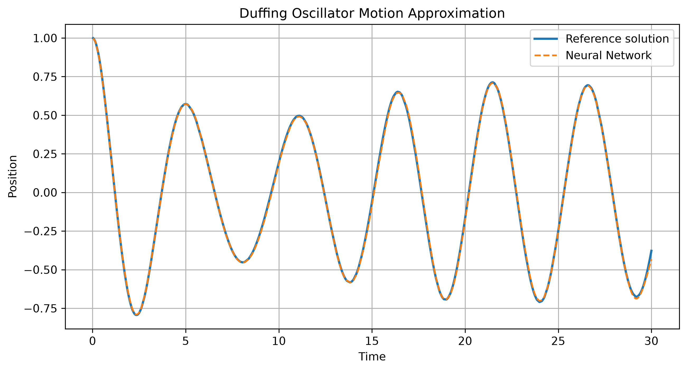

# Neural Networks for Dynamical Systems

<p align="center">
  
</p>

## Overview

This repository investigates whether feedforward neural networks can learn the behavior of classical dynamical systems directly from simulated data.

The project evaluates the performance of multilayer perceptrons (MLPs) on a range of physical systems with increasing levels of complexity, from simple harmonic motion to chaotic dynamics. The objective is to identify both the capabilities and the limitations of neural networks when approximating deterministic and nonlinear systems.

The work was developed as an independent research project and is accompanied by a complete scientific paper included in this repository.

---

## Research Question

**Can a neural network learn the mathematical laws governing physical systems, and where does its predictive capability begin to fail as system complexity increases?**

---

## Implemented Physical Systems

The repository currently includes simulations and neural network models for:

* Harmonic Oscillator
* Damped Harmonic Oscillator
* Forced Harmonic Oscillator
* Duffing Oscillator
* Simple Pendulum
* Double Pendulum

Each system is implemented independently, allowing experiments under different physical parameters.

---

## Methodology

For each physical system:

1. Generate a reference dataset using numerical or analytical solutions.
2. Split the dataset into training and testing subsets.
3. Train a fully connected neural network (MLP).
4. Evaluate prediction accuracy using multiple performance metrics.
5. Analyze how changes in physical parameters affect the model's performance.

The study includes parameter sweeps for several systems in order to investigate the robustness of the neural network under different dynamical regimes.

---

## Evaluation Metrics

The following metrics are used throughout the project:

* Mean Squared Error (MSE)
* Mean Absolute Error (MAE)
* Maximum Absolute Error
* Coefficient of Determination ($R^2$)

Training history and prediction figures are automatically generated for every experiment.

---

## Repository Structure

```text
.
├── data/               Dataset utilities
├── evaluation/         Model evaluation
├── experiments/        Parameter sweeps and analysis
├── models/             Neural network implementation
├── paper/              LaTeX source and PDF of the paper
├── physics/            Physical system simulations
├── results/            Experimental results
├── training/           Model training
├── config.py           Global configuration
├── main.py
└── README.md
```

---

## Technologies

* Python
* PyTorch
* NumPy
* SciPy
* Matplotlib

---

## Installation

Clone the repository:

```bash
git clone https://github.com/aosinaldeal/Neural-Networks-for-Dynamical-Systems.git
cd Neural-Networks-for-Dynamical-Systems
```

Install the required packages:

```bash
pip install -r requirements.txt
```

---

## Running Experiments

Train a model:

```bash
python -m training.train
```

Evaluate a trained model:

```bash
python -m evaluation.evaluate
```

---

## Configuration

Experiments can be configured by modifying:
(src/config.py)

The main parameters are:

- `TYPE`: physical system to simulate
- `EPOCHS`: training epochs
- `LEARNING_RATE`: optimizer learning rate
- `SAMPLES`: generated data points
- `DURATION`: simulation time


## Scientific Paper

The complete paper can be found here:

**[📄 Neural Networks for Dynamical Systems (PDF)](paper/paper.pdf)**

It describes:

* The theoretical background of each dynamical system.
* The neural network architecture.
* Experimental methodology.
* Parameter sweep analyses.
* Results and discussion.
* Conclusions and future work.

---

## Future Work

Possible extensions of this project include:

* Recurrent and transformer-based neural networks.
* Physics-Informed Neural Networks (PINNs).
* Neural Operators.
* Additional chaotic systems.
* Long-term trajectory prediction.
* Generalization across physical systems.

---

## License

This project is released under the MIT License.

See the [LICENSE](LICENSE) file for details.
